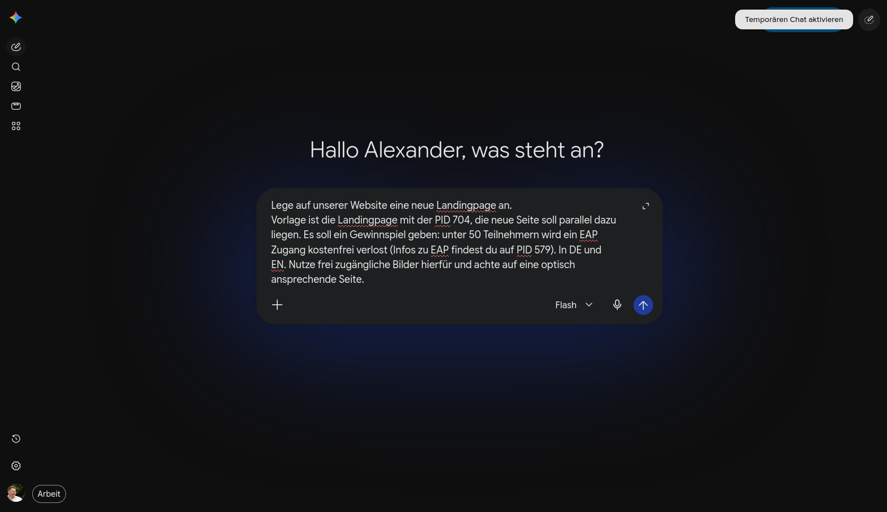
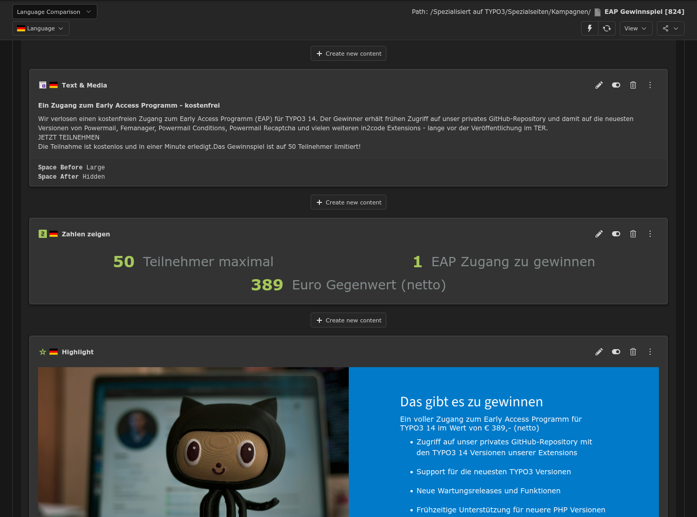
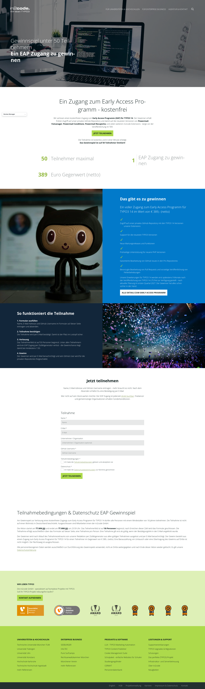

# in2mcp - MCP Server for TYPO3

Turns a TYPO3 installation into a **Model Context Protocol (MCP) server**, so that MCP clients like
Claude (Desktop, Web, Code), Gemini or ChatGPT can connect to the CMS and work on it - reading the page tree,
inspecting existing content and creating or editing records within the permissions of the connected
backend user.

Example usage from Google Gemini in Browser to create a new page in your TYPO3:


Content elements created from AI in TYPO3 backend:


Ready created frontend without the need of a backend login:


## Table of Contents

- [Introduction](#introduction)
- [Requirements](#requirements)
- [Installation](#installation)
- [Quick start](#quick-start)
- [Tools](#tools)
- [Permissions](#permissions)
- [Contribution with DDEV](#contribution-with-ddev)
- [Changelog](#changelog)

## Introduction

MCP knows three roles: a **host** (the chat application), a **client** (the connector inside the host)
and a **server** (the system that offers the capabilities). in2mcp is the **server** part: TYPO3
exposes `tools`, `resources` and `prompts`, the LLM decides when to call them.

## Quick start

```bash
# 1. activate the server in the extension configuration (setting "mcpServer")
#    the endpoint is /typo3/mcp and can be renamed with the setting "mcpServerPath"
# 2. create an api key for a backend user
vendor/bin/typo3 in2mcp:apikey <uid|username>
# 3. connect a client
claude mcp add --transport http in2mcp https://your-domain.org/typo3/mcp --header "Api-Key: <key>"
```

For claude.ai and ChatGPT: add a custom connector with the URL, set authentication to *None* and put the key
into a request header named `api-key`. See [Documentation/McpServer.md](Documentation/McpServer.md) for every
client, the OAuth situation of Gemini Enterprise and the full reference.

## Tools

Reading: `get_backend_user`, `get_page_tree`, `get_page`, `search_pages`, `get_schema`, `get_record`,
`find_records`, `search_files`

Writing: `create_page`, `update_page`, `create_content_element`, `update_content_element`, `create_record`,
`update_record`, `add_child_record`, `localize_record`, `add_file_from_url`, `add_file_reference`,
`delete_record`, `move_record`, `clear_cache`

Pages and content elements have their own tools; `create_record` and `update_record` cover every other table the
backend user may write, for example a form or a news entry. `search_files` finds files that already exist and
`add_file_reference` connects one to a file field. `add_file_from_url` brings a new file in - it is **off by
default**, because it makes the server perform an outgoing request that a client decides on.

## Permissions

in2mcp has no permission concept of its own. The api key identifies a TYPO3 backend user, that user is
initialized like in a regular backend request, and everything afterwards runs through the regular TYPO3 checks:
page permissions and page mounts when reading, the **DataHandler** when writing. So an MCP client can do exactly
what that backend user can do in the backend - and nothing beyond it. Emptying the api key or disabling the user
revokes the access immediately.

Concretely: page mounts and page permissions when reading pages and records, the **DataHandler** when writing,
the **file mounts** when searching or attaching files, and the page mounts again when clearing the cache of a
single page. Raw HTML stays raw for a user who may use the `html` content element and is sanitized for everybody
else, because that is what TYPO3 does with a backend save.

There is one deliberate exception: tables that hold authentication data or internal bookkeeping (`be_users`,
`fe_users`, `sys_log`, `sys_refindex` and their relatives) are refused for every user, administrators included,
so an api key that leaked cannot create a backend user. See `TableAccessService::DENIED_TABLES`.

An api key has the form `<uid>.<secret>` and only the secret is stored, hashed. Failing authentications are rate
limited per ip address. Multi factor authentication is skipped for MCP requests, so an installation that
enforces MFA should hand out api keys accordingly. See [Documentation/McpServer.md](Documentation/McpServer.md)
for the full picture.

## Requirements

- TYPO3 13.4 LTS or 14.x
- PHP 8.2 or higher

## Installation

### With composer

```
composer require in2code/in2mcp
```

### With extension manager

Search for `in2mcp` in the TYPO3 extension manager and install it.

## Contribution with DDEV

This repository ships a ready to use DDEV environment including a small TYPO3 test instance
(database dump and fileadmin files).

```bash
ddev start
ddev initialize
```

`ddev initialize` links the TYPO3 configuration from `.ddev/TYPO3/` into `config/`, imports the
database dump from `.ddev/data/db.sql.gz`, extracts the fileadmin archive, runs `composer install`
and copies the default `.htaccess`.

- Frontend: https://in2mcp.ddev.site
- Backend: https://in2mcp.ddev.site/typo3 (admin / admin)

### Notes on `ddev start`

- `additional.php already exists and is managed by the user.` is expected. `config/system/additional.php`
  is a symlink to `.ddev/TYPO3/additional.php` and therefore not DDEV managed - exactly what we want.
- `.ddev/web-build/Dockerfile` forces git to HTTP/1.1 inside the web container. Without it, git 2.39.5
  fails on GitHub's HTTP/2 ref listing (`could not read Username` / `expected flush after ref listing`),
  which breaks `install_nvm.sh` on every container start and any git based composer repository.

Useful commands:

```bash
ddev composer install                       # install dependencies
ddev exec .Build/bin/typo3 cache:flush      # flush all caches
ddev mysql                                  # database shell
ddev createdumpfile                         # update .ddev/data/db.sql.gz from current database
ddev createfilesarchive                     # update .ddev/data/fileadmin.tar.gz from current files
```

## Changelog

| Version | Date       | State | Description                                                                              |
|---------|------------|-------|------------------------------------------------------------------------------------------|
| 2.0.0   | 2026-09-02 | alpha | Allow creating of any records, adjust endpoint, allow inserting images, security reviews |
| 1.0.0   | 2026-09-02 | alpha | Initial extension release                                                                |
